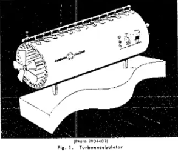
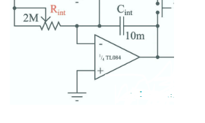
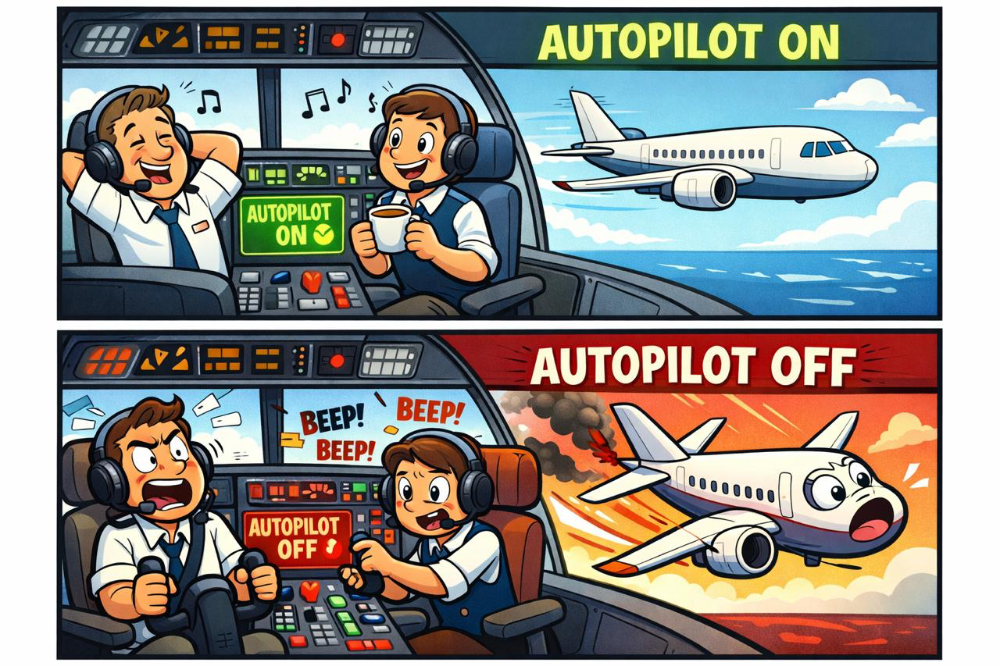
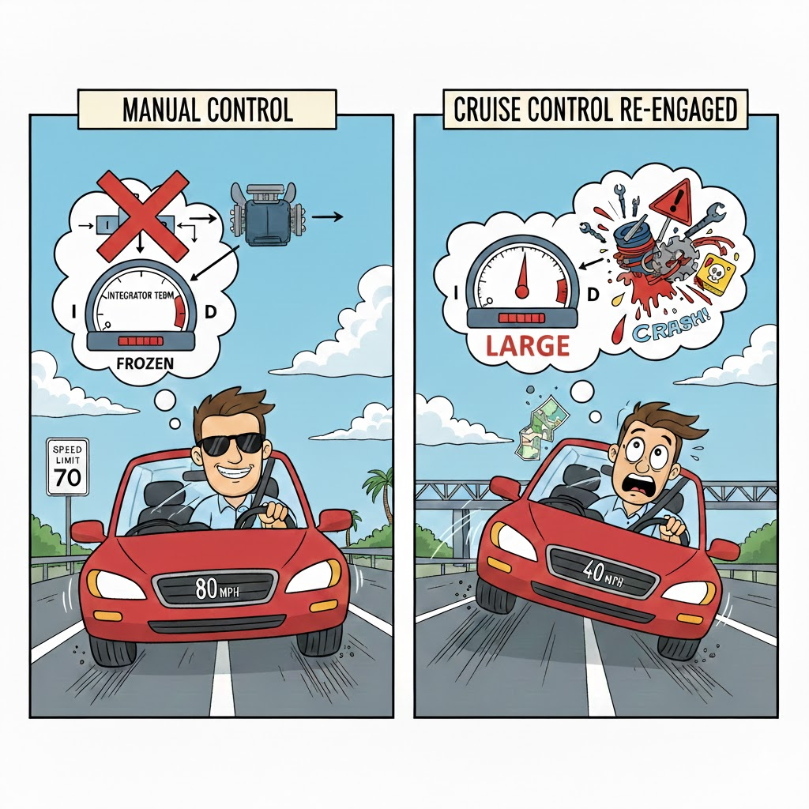

# Advanced PID Topics
Here is where you'll add your mini-report. Fill in (or create) a new section with a 2nd level heading `##My Topic` and use markdown formatting. 
Images can be included by adding the image file to /imgs and referencing it ``.

## Markdown Example - Turbo Encabulator

#### Issue: 

The first version of the machine had a base-plate of prefabulated aluminite, surmounted by a malleable logarithmic casing in such a way that the **2** main spurving bearings were in a direct line with the pentametric fan. 


The latter consisted simply of **six** hydrocoptic marzlevanes, so fitted to the ambifacient lunar waneshaft that side fumbling was effectively prevented. 

```py
#lotus-o-delta algorithm
for i in range(7):
    tremie_pipe += gridlespring + 0.5*marzlevane[i]
```
#### Solution:

The main winding was of the normal lotus-o-delta type placed in panendermic semi-bovoid slots in the stator, every **seventh** conductor being connected by a non-reversible tremie pipe to the differential girdlespring on the "_up_" end of the grammeters.




## Sample Time
#### Issue: 

#### Solution:


## Derivative Kick
#### Issue: 
When we encounter a sharp change in the setpoint, the derivitive term in our control function also spikes sharply due to the rapid change. To see this, consider

$$e(t)=r(t)-y(t),$$
$$\dot{e}(t)=\dot{r}(t)-\dot{y}(t).$$

So for finite $\dot{y}(t)$, 
$$(\dot{r}(t) \rightarrow \infty) \Rightarrow (\dot{e}(t) \rightarrow \infty). $$

Looking at our control function,
$$u(t)=K_{p} \ e(t)+K_{i} \int_{0}^{t}e(\tau) \ d\tau \ +K_{d} \ \dot{e}(t),$$
we can see that a spike in $\dot{e}(t)$ leads to a spike in out control  variable $u(t)$, assuming a non-negligible $K_{d}$ value.

This rapid spike can lead to issues such as hardware stress, instability and a reduction in controller performance.

#### Solution:

## Tuning Changes
#### Issue: When you try to change the parameters of the controller while it is running it can introduce artefacts. E.g. this little bump:


#### Solution:
This issue occurs because when you change the value of $K_I$ the entire error sum is multiplied by the new  $K_I$ rather than the previous value of $K_I$. This causes a discontinuity because the correction due to the integral term changes abruptly.

This isn't an issue for proportional or derivative gain because they don't have any memory so there is no discontinuity.

There is a simple solution, instead of tracking just the sum of the historical errors, you store the sum of $(e\times K_I)$


When implemented in analogue electronics with an op-amp circuit $K_I$ is already included in the integral. This is because the voltage across the capacitor is $\frac{1}{C}\int i(t) dt$ and $i(t)$ is given by $\frac{v_i(t)}{R_{\text{int}}(t)}$. This gives $\frac{1}{C}\int \frac{v_i(t)}{R_{\text{int}}(t)} dt$ which includes $R_{\text{int}}$ inside the integral.


Integrator Circuit

## Reset Windup
#### Issue: 
Reset Windup refers to the case when the PID controller tries to do adjust for out of bound errors, e.i the PID tries to get to some "unrealistic" values thinking it can. This results in anomalous lags to the input controller.


#### Solution: 
To solve this issue we can tell the PID what the limits are, and once it reached them it will stop integrating. The proportional and the derivative terms will also contribute to the lag, hence we also need to bound the output value.
Here we can see an example of code that would limit the values: 
```py 
#limit integrator
      if(ITerm> outMax) ITerm= outMax;
      else if(ITerm< outMin) ITerm= outMin;
```
```py
#limit output
      if(Output > outMax) Output = outMax;
      else if(Output < outMin) Output = outMin;
```     
Here the user is allowed to change the limits  of the values for integrator and output:
```py
void SetOutputLimits(double Min, double Max)
{
   if(Min > Max) return;
   outMin = Min;
   outMax = Max;
    
   if(Output > outMax) Output = outMax;
   else if(Output < outMin) Output = outMin;
 
   if(ITerm> outMax) ITerm= outMax;
   else if(ITerm< outMin) ITerm= outMin;
}
```  
And here is the result after "clamping" both integrator and output: 


## Manual toggle
#### Issue: 





Manual toggle is an issue that arises when a system changes from being manually controlled to being controlled by an automatic system.

To see this, we consider an example. Imagine a man driving at 70mph on a motorway. He is using cruise control, an automatic mechanism which keeps him at 70mph. Let's say he turns off cruise control and drives manually. He accelerates to 80mph and drives for a bit. He then switches cruise control back on.

If the issue of manual toggle has not been suitably planned for, this can cause a dangerous issue. When the cruise control mechanism was turned off, the PID system was frozen in the internal state it had at that moment. This means that the actuator is giving an output appropriate to 70mph, not 80mph. In this context, this means the car will have a sudden drop in speed and a dangerously quick decceleration.

#### Solution:


## Initialisation
#### Issue: 
If the PID controller is toggled off, when it is turned back on again the controller will incorrectly try to correct to the previous set-point. If the set point has changed this results in an unintended bump where the PID controller moves the wrong way. 

(add image)

#### Solution:
This unintended spike can be prevented by reinitialising upon the change from manual to automatic. For a smooth transition, the input term is updated to the new input, and the integral term is set to the output. This reinitialises the PID controller and allows for seamless switching between the manual and automatic modes. 

```py
void Initialize()
{
   lastInput = Input;
   ITerm = Output;
   if(ITerm> outMax) ITerm= outMax;
   else if(ITerm< outMin) ITerm= outMin;
}
```


## 'Proportional on Measurement'

#### What is PonM?
Proportional on Measurement, sometimes abbreviated to *PonM*.

In a standard PID, the proportional *'P'* term acts on the error, as: 
$$

e(t)=r(t) - y(t)

$$
where $r(t)$

#### Issue: 


#### Solution:


