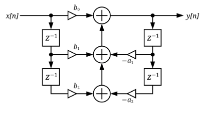
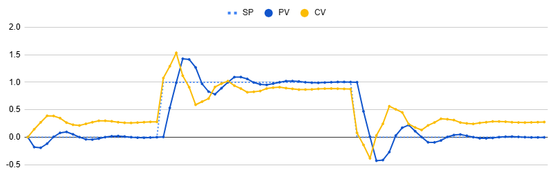

# Implementation Examples
Here is where you'll add your mini-report. Create a new section with a 2nd level heading `##My Topic` and use markdown formatting. 
Images can be included by adding the image file to `/imgs` and referencing it ``.
Code can also be included, please put it in a suitably named `/implementations/my_thing` directory.

## A Spreadsheet IIR Controller
Excel (or equivalent) can do PID control too!
I present the [Infinite Impulse Response SPREADSHEET](https://bit.ly/fbnl26iir)

The output $y_0$ is the sum of 5 terms, 3 feed-**forward** components based on the most recent 3 inputs ($x_0, x_1, x_2$), and 2 feed-**back** components based on the previous outputs ($y_1, y_2$). In the diagram the $z^{-1}$ boxes represent time delay, and triangles are digital amplification.



There are some equations defining the 'process response' (i.e. how x depends on y) and cells to adjust the 5 branch gains. When adequately tuned the spreadsheet can demonstrate compliance to a varying setpoint with some minor ringing.



## Vulcan - a bakeout oven controller
To safely bake UHV components and chambers, a feedback controlled oven is used to smoothly an slowly ramp up, hold steady, and ramp down the temperature of an oven.

For this sytem:
 * the **Sensors** are three K type thermocouples, which are averaged, with some error detection logic in case of failure (and an auxilliary sensor monitors the vacuum pressure, this not used for feedback)
 * the **Control** element is a PWM actuated bank of resistive heaters. The PWM cycle time is 10 seconds.
 * the **Process response** is very slow because it is based on the thermal response of 10s of kg of stainless steel, and parts of it are very well thermally insulated by vacuum!
 * a **critical requirement** is that the rate of change of temperature not exceed a given value, typically around 5 degC per hour
 * different behaviour is needed for the three phases (ramp up, hold, and ramp down)

 The feedback control lives within a finite state machine to ensure safe behaviour at all times. The various 'states' and 'transitions' between them are represented below.
 

 #### The ramp-up phase
 is implemented as a P only (proportional) type feedback loop, but acting on the time derivative of temperature, and modifying not the heater power, but a heater speed (which is the heater's time derivative). This strategy smooths out sudden or instantaneous changes.

 ```py
 def adjust_ramp(self):
    '''Tune the power setting within a temperature ramp. Derivative feedback. Power output is always monotonic'''
    if self.state is 'ramp_up':
        dir = 1.0
    ...
    #decide how to adjust the speed (heater rate of change)
    if dir*self.temp['rate'] > (self.target_rate + self.tolerance_rate): #changing too fast
        self.speed = self.speed - Oven.ADJUST
    if dir*self.temp['rate'] < (self.target_rate - self.tolerance_rate): #changing too slow
        self.speed = self.speed + Oven.ADJUST
    # after deciding the heating/cooling speed, change the power
    if self.state is 'ramp_up':
        self.power = self.power + (self.speed * self.period)
    ...
    if self.power > Oven.MAXPOWER:
        logging.warning('heater power has been limited to {:.2f}%'.format(Oven.MAXPOWER))
        self.power = Oven.MAXPOWER
    if self.power < 0.0:
        logging.warning('heater power has dropped to zero')
        self.power = 0.0
    return self.power
 ```
N.B. some lines have been simplified, see [the code](implementations/vulcan) for full details.